# claude-todoist-agent

**Hand tasks to Claude from Todoist. Claude Code does the work on your computer. The results come back to Todoist.**

<p align="center">
  
</p>

Todoist is where you hand off and review. Claude Code does the work, on your machine, with your own Claude plan. There's no server, no API key, and nothing to host.

## Three steps

### 1. Delegate: put the task on Claude's turn

In Claude Code:

```
/todoist-agent:delegate Compare standing desks under $500 with a crossbar
```

Claude turns that into a clear Todoist task (goal, what "done" means, which project folder), labels it `@claude`, and asks you if anything's unclear.

**Or skip Claude Code entirely:** add the `@claude` label to any task in Todoist, from your phone or anywhere.

### 2. Run: Claude Code does the work

```
/todoist-agent:run
```

Start Claude Code in your projects folder, type this, and walk away.

- Every `@claude` task gets its own worker, all at the same time.
- Each worker works in the task's project folder and saves its files there. Code goes on a `claude/…` branch, never your working copy.
- It can read the tools you've connected to Claude Code (web, Slack, Drive, email, meeting notes) for context.

<sub>Want to preview first? `/todoist-agent:run --dry-run` shows the plan and changes nothing. `/todoist-agent:run <task>` runs just one. If a run gets interrupted, the next one offers to requeue what it left behind.</sub>

### 3. Review: back in Todoist

Each task now has a comment from Claude and your label. Read it in the Todoist app, or go through them all with:

```
/todoist-agent:review
```

| Comment | Meaning | You |
|---|---|---|
| ✅ Ready for review | Done | Open the files it links to. |
| 🟡 Partly done | Some left | See "Your next steps". |
| ❓ Needs your input | Blocked | Answer its questions. |

Then either:
- **Send it back:** comment with feedback and switch the label to `@claude`. The next run builds on the same files.
- **Keep it:** it's yours now. Nothing to do.
- **Complete it:** you complete the task. Claude never does.

> **Claude never sends, posts, shares, deletes, completes, or pushes anything.** It leaves you files, drafts, and branches to act on. A built-in guard enforces this, even in bypass mode.

## Set up once (about 10 minutes)

You need a **Todoist** account and **Claude Code** signed in with your Claude plan (Pro, Max, Team, or Enterprise). Also `python3` and `git`, which macOS and most Linux already have.

**1. Install Claude Code** from [code.claude.com](https://code.claude.com). Run `claude` in a terminal and sign in.

**2. Connect Todoist** to Claude Code. This uses Todoist's official connector:

```bash
claude mcp add --transport http --scope user todoist https://ai.todoist.net/mcp
```

Then in Claude Code: `/mcp` → **todoist** → **Authenticate**, and approve in the browser. (Already connected Todoist on claude.ai? That works too; skip this step.)

**3. Install this plugin** inside Claude Code, then restart it:

```
/plugin marketplace add nbdesai1992/claude-todoist-agent
/plugin install todoist-agent@claude-todoist-agent
```

**4. Run setup:**

```
/todoist-agent:setup
```

It asks for two things:
- **Your label**, e.g. `@sam`. Tasks come back to you under it.
- **Your projects folder**, e.g. `~/Projects`, the folder with one subfolder per project.

It then creates the `@claude`, `@claude-working`, and your labels in Todoist, saves your settings, and offers approval prompts for risky Todoist actions.

**Done.** Try step 1 above.

<sub>**Optional:** put a `CLAUDE.md` in a project folder to tell Claude how work there should be done (sources, style, where drafts go). **Updating:** `claude plugin marketplace update claude-todoist-agent && claude plugin update todoist-agent@claude-todoist-agent`, then restart.</sub>

## What's inside

A Claude Code plugin, made of:

| Piece | What it does |
|---|---|
| `/todoist-agent:setup` | One-time setup: labels, settings, approval prompts. |
| `/todoist-agent:delegate` | Turns a request into a clear task labeled `@claude`. |
| `/todoist-agent:run` | Works the `@claude` queue and posts each result back. |
| `/todoist-agent:review` | Walks you through what came back. |
| Worker agent | Does a single task. Reads your tools, writes files in the project folder. No Todoist access. |
| Guard | Blocks the worker from sending, sharing, deleting, completing, or pushing. |

Labels show whose turn it is: `@claude` (queued), `@claude-working` (a run has it), and yours. Other AI agents with Todoist access can delegate too: see [docs/delegation-template.md](docs/delegation-template.md).

## Reference

### The delegation template

```
**Goal:** Compare standing desks under $500 for a small home office.
**Done when:** A markdown table of the top 3 with prices, links, and a recommendation.
**Folder:** /Users/me/projects/home-office   (or just home-office, under a root)
**Context:** Needs a crossbar. See the #home-office Slack thread from last week.
**Stop before:** Don't buy anything.     (optional)
**Model:** sonnet                        (optional; default Opus, high effort)
```

The delegate skill always fills it in, including the folder: it matches the task to an existing project folder or proposes a new one. Tasks you write by hand don't have to follow it. A worker scopes whatever it gets, and if the task isn't clear enough it hands the task back with specific questions.

### Models

Workers run in your Claude Code session, on your account. By default they use **Opus at high effort** (set in `agents/worker.md`). To change the model for every task, set `run.model`. For a single task, add a `**Model:**` line. Effort can only be set in the worker definition, because Claude Code's subagent call accepts a model but not an effort level.

### Connectors

Workers get the same MCP connectors as the session you run from (claude.ai connectors, `claude mcp add` servers). Whatever is connected and signed in there, they can read. Nothing to configure per worker.

### Folders

Claude Code can't start a subagent in a different working directory. So the dispatcher works out each task's folders and passes them in as absolute paths. The worker uses them in every command and reads the work folder's `CLAUDE.md` itself.

Every task runs in a **work folder**, and its files land there, next to the rest of that project. The folder comes from:

1. the task's `Folder:` line: an absolute path, or a bare name like `home-office` that means that subfolder of one of your `folders.roots`;
2. otherwise the Todoist project's folder in `folders.projects`;
3. otherwise nothing: the run hands the task back ❓ with the 2–3 best-fitting project folders as options. It doesn't guess.

A `Folder:` that doesn't exist yet but sits directly inside a root is a new project, and the run creates it. **Put a `CLAUDE.md` in a project folder to tell workers how tasks there should be done**: which sources to check, the house style, where outputs go, how to run tests.

If the work folder is a git repository, the worker leaves your checkout alone. It creates a worktree at `~/todoist-agent/<task-id>-<slug>/worktree` on a `claude/<task-id>-<slug>` branch, commits there, and never pushes. That's the only thing `folders.workspace` is for.

## Safety

- **Workers:** a PreToolUse hook (`plugins/todoist-agent/scripts/guard.py`) acts only on calls from the worker subagent. Outside systems are read-only:
  - **MCP tools run only if they're clearly reads** (get, list, search, read, query…). Anything else is denied, including drafts and tool names it can't classify.
  - **Send, share, post, schedule, delete, trash, archive, and complete** stay denied on every server, even for tools you allow.
  - **Every Todoist tool** is denied, since the dispatcher owns Todoist.
  - **Shell commands** that push (`git push`), discard work (destructive git), write through `gh` or `curl`, publish packages, or use `ssh` or `sudo` are denied.
  - **Settings:** edits to `~/.claude/` and the todoist-agent config are denied.

  Hook denials apply even in bypass-permissions mode. The worker's `disallowedTools` also removes Todoist and messaging tools up front.
- **The run step** only swaps labels and posts one comment per task.
- **Review** completes a task only when you pick "Complete it".
- **Your approval rules:** setup recommends `ask` rules for the Todoist tools that delete, complete, or reach other people. Claude Code honors explicit `ask` rules in every permission mode.

### Permissions

Workers run in your Claude Code session and inherit its working directory and permission mode. **Start runs from your root folder** (the parent of your project folders), so every work folder is inside the session. In the default mode, workers will still stop to ask about shell commands and edits. For unattended runs, use `claude --permission-mode acceptEdits` or `bypassPermissions`: the guard hook above and your `ask` rules still apply in both.

## Configuration

`~/.config/todoist-agent/config.toml`. Every key is optional.

```toml
[labels]
claude = "claude"            # Claude's turn
human = "human"              # your turn, e.g. your first name
working = "claude-working"   # claimed by a run, in progress

[folders]
roots = []                              # folders whose subfolders are projects, e.g. ["~/Projects"]
workspace = "~/todoist-agent"          # git worktrees live here

[folders.projects]                      # Todoist project → work folder (overrides roots)
# "Side project" = "~/code/side-project"

[run]
max_parallel = 4                        # workers started at once
model = ""                              # worker model for every task: opus, sonnet, haiku, fable
                                        # empty = worker default (Opus, high effort)

[context]
about = ""        # who you are, your role, house style; given to every worker
sources = ""      # where context lives, e.g. "work threads in Slack, meeting notes in Granola"

[worker]
allow_tools = []  # exceptions to read-only, e.g. ["mcp__claude_ai_Gmail__create_draft"]
                  # send/share/delete-style tools stay blocked regardless. Needs Python 3.11+.
```

## Layout

```
plugins/todoist-agent/
  skills/delegate  run  review  setup    the workflow, as Claude Code skills
  agents/worker.md                       the worker subagent: scope, do, report
  hooks/hooks.json, scripts/guard.py     worker guardrails
docs/delegation-template.md              instructions to paste into other agents
docs/how-it-works.svg                    the animated diagram above
tests/test_guard.py                      python3 -m unittest discover -s tests
```

## Roadmap

- **Scheduled runs:** the run step is a plain skill, so a schedule is `claude -p "/todoist-agent:run"` on cron or launchd. That comes after manual runs have proven themselves.

## License

MIT
